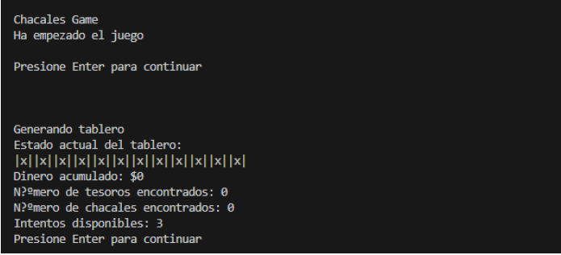

# Juego de Chacales en MIPS

Este proyecto implementa el juego de Chacales en lenguaje MIPS, un conjunto de instrucciones utilizado comúnmente en arquitecturas de computadoras educativas y embebidas.

## Descripción

El juego de Chacales es un juego de tablero donde el jugador debe descubrir tesoros mientras evita a los chacales. El tablero consta de 12 casillas inicialmente ocultas, con 4 chacales y 8 tesoros distribuidos aleatoriamente al inicio de cada partida.

El objetivo del juego es recolectar 4 tesoros antes de descubrir todos los chacales o repetir el mismo número de casilla oculta 3 veces consecutivas.

## Funcionalidades

- **Tablero Dinámico:** Distribución aleatoria de chacales y tesoros al inicio de cada partida.
- **Interacción de Usuario:** Elección de casillas para descubrir su contenido.
- **Gestión de Estado:** Mostrar el estado del tablero, dinero ganado, tesoros encontrados y número de chacales descubiertos en cada turno.
- **Decisión Estratégica:** El jugador decide continuar jugando para aumentar su dinero o retirarse con la cantidad acumulada.

## Requisitos
1. Tener instalado Java 8. Si no lo tienes instalado lo puedes descargar desde [https://www.java.com/es/download/ie_manual.jsp](Windows x64) o [https://javadl.oracle.com/webapps/download/AutoDL?BundleId=249843_43d62d619be4e416215729597d70b8ac] (MacOs x64)
2. Reiniciar el computador despues de instalar Java

## Instalación

1. Clona el repositorio:
   git clone [https://github.com/mfalvarezd/ChacalesGame.git]
2. Comando para ejecutar el proyecto: 
* Ejecutar desde la carpeta del proyecto
* java -jar .\simulador\Mars4_5.jar .\chacalesGame.asm
3. También se puede utilizar VS Code, y ejecutar la tarea, Seleccionando Terminal seguido de "Run Task" y luego seleccionar "Run MARS"
## Uso

Inicia el juego según las instrucciones del simulador MIPS.
Sigue las indicaciones en pantalla para gestionar tu estrategia y decidir continuar o retirarte.
## Contribución
Si deseas contribuir a este proyecto, sigue estos pasos:

1. Haz un fork del repositorio.
2. Crea una nueva rama (git checkout -b feature/nueva-funcionalidad).
3. Realiza tus cambios y realiza commit (git commit -am 'Añade nueva funcionalidad').
4. Haz push a la rama (git push origin feature/nueva-funcionalidad).
5. Crea un nuevo Pull Request.

## Autores
Moises Alvarez(mfalvare@espol.edu.ec), Andres Zambrano(ajzambra@espol.edu.ec)

Enlace al proyecto: [https://github.com/mfalvarezd/ChacalesGame.git]
